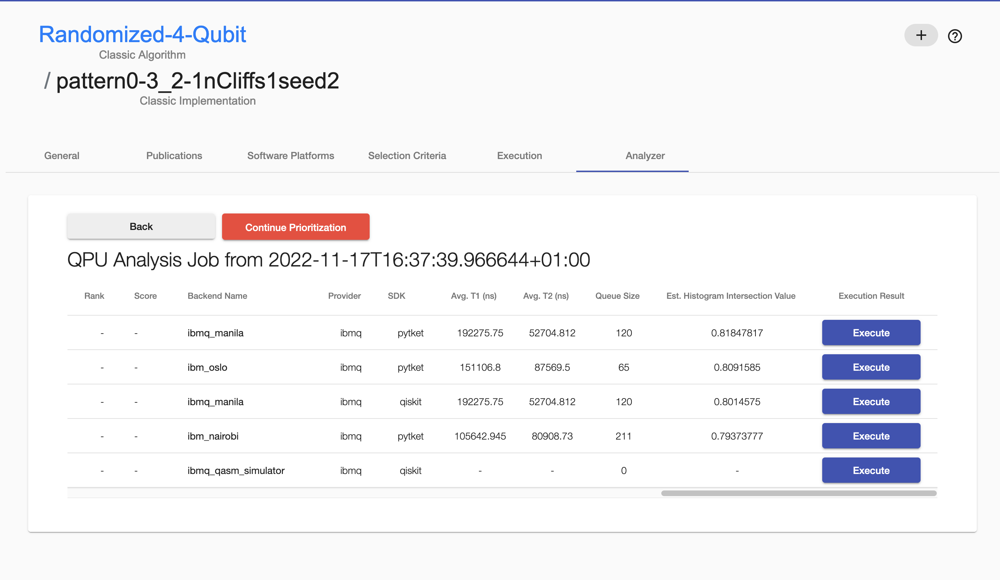

# How to Select Quantum Compilers and Quantum Computers Before Compilation

This guidance guides you through the process of compiling a quantum circuit on different quantum computers with several quantum compilers using the [NISQ Analyzer](https://github.com/UST-QuAntiL/nisq-analyzer/) and [additional components](https://github.com/UST-QuAntiL/nisq-analyzer-content/blob/master/pre-selection/Docker/README.md).  

All data of the case study are contained in [sample-data](./Case-Study).

### Prerequisites
+ Docker Engine - [Install Guide](https://docs.docker.com/engine/install/)
+ Docker Compose - [Install Guide](https://docs.docker.com/compose/install/)
+ Clone this repository
+ Required ports are listed [here](./Docker/README.md)

## Application

2. A list of algorithms is presented as starting point. You can add a new algorithm (button under "Search") by inserting a name and choosing its computation model.
   

3. In context of an algorithm, go to the "Implementations" tab where implementations are listed. You can add a new implementation to the algorithm by choosing a name for the circuit you want to compile.
   

4. In context of the implementation, go to the "Selection Criteria" tab > insert the URL of the raw circuit, specifiy its SDK and select its language > save your adaptions.  
   

5. Go to the "NISQ Analyzer" tab in context of the implementation > click "New Analysis", insert you token of the Qiskit SDK, in case IBMQ is selected. Specify your preferences, the settings, and choose compilers to be considered.
   The analysis is complete when the "Show analysis" button occurs.
   
   

6. Clicked on the "Show analysis" button, you can see suitable compiled circuits and their metric values for different quantum computers of several quantum compilers.
   To see all metric values scroll horizontally. It is automatically checked if the quantum computer metrics used for compilation are still up-to-date.
   

7. To prioritize the list of compiled circuits, click the "Prioritize" button, as in previous work, select predefined preferences or define own weights. A new feature is that the ratio between short waiting times and precise execution results can now be defined.
     

8. If a ranking based on stable execution results is desired, a "learning weights" processing dialog appears, defined in previous work. When weights are learned by the selected weighting method, the list of weights appears, and they can be adjusted. By clicking "Ok", the prioritization with the weights is started.

9. When the prioritization process is finished, the rank and the score of each compiled circuit is presented.
   

10. As in previous work, the sensitivity of the ranking can be analyzed (in case TOPSIS or PROMETHEE II were previously selected to rank) by clicking the "Analyze Rank Sensitivity" button. The dialog enables to adjust the analysis parameters.
    As soon as the analysis result is returned, a "Sensitivity Analysis Result" button appears. By clicking on this button, a new window opens, showing a plot that visualizes the analysis result.
    

11. For executing a compiled circuit: click "Execute" > wait some time > click "Show result".
       

### Stop the environment

1. To stop the environment go to the console window with the docker-compose running, stop the process (e.g. control+shift+C for Mac).
2. To remove all volumes run `docker-compose down -v`.

## Haftungsausschluss

Dies ist ein Forschungsprototyp.
Die Haftung für entgangenen Gewinn, Produktionsausfall, Betriebsunterbrechung, entgangene Nutzungen, Verlust von Daten und Informationen, Finanzierungsaufwendungen sowie sonstige Vermögens- und Folgeschäden ist, außer in Fällen von grober Fahrlässigkeit, Vorsatz und Personenschäden, ausgeschlossen.

## Disclaimer of Warranty

Unless required by applicable law or agreed to in writing, Licensor provides the Work (and each Contributor provides its Contributions) on an "AS IS" BASIS, WITHOUT WARRANTIES OR CONDITIONS OF ANY KIND, either express or implied, including, without limitation, any warranties or conditions of TITLE, NON-INFRINGEMENT, MERCHANTABILITY, or FITNESS FOR A PARTICULAR PURPOSE.
You are solely responsible for determining the appropriateness of using or redistributing the Work and assume any risks associated with Your exercise of permissions under this License.

## License

SPDX-License-Identifier: Apache-2.0
