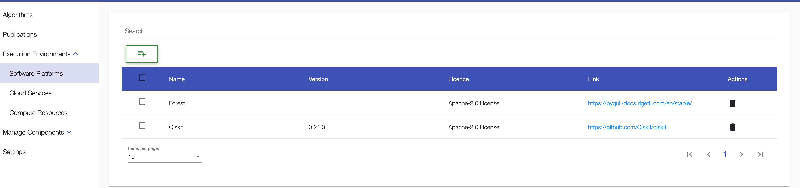
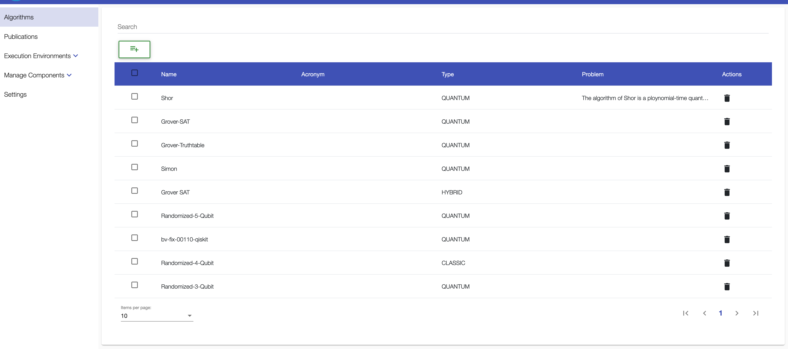
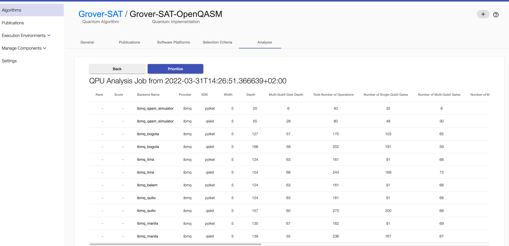
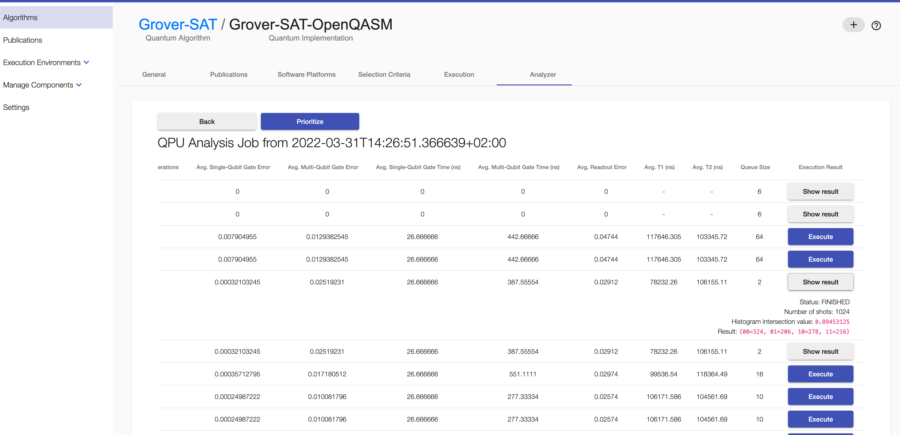
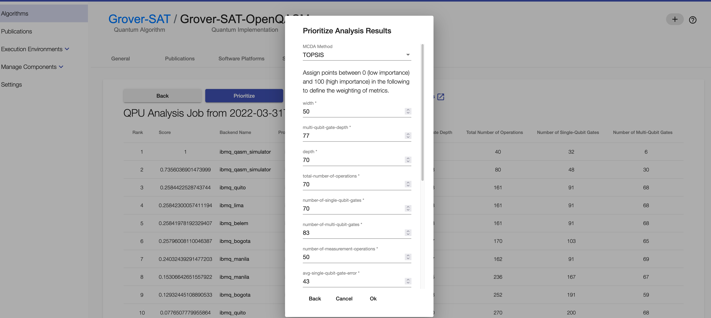
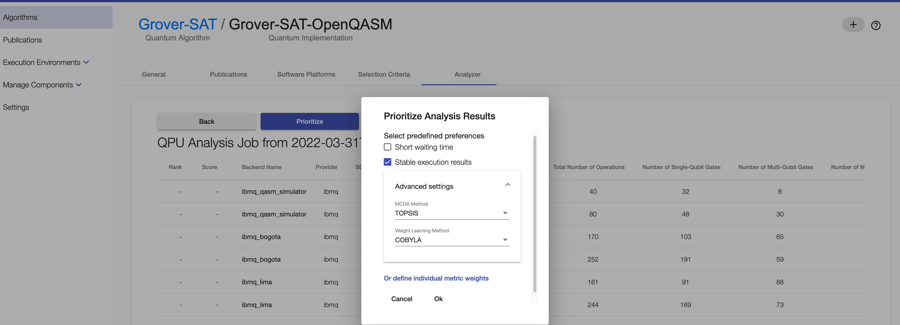
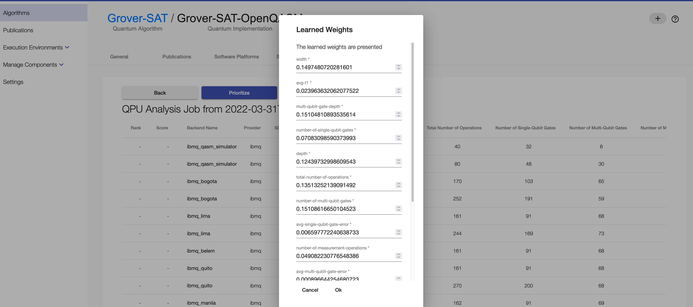
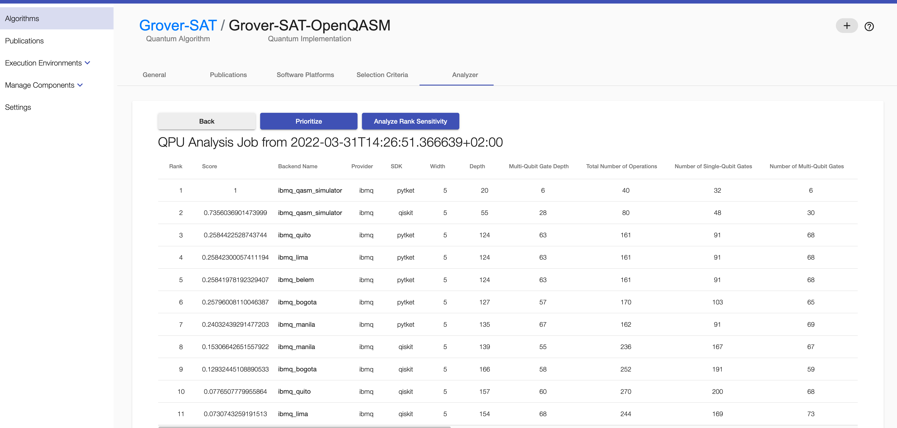
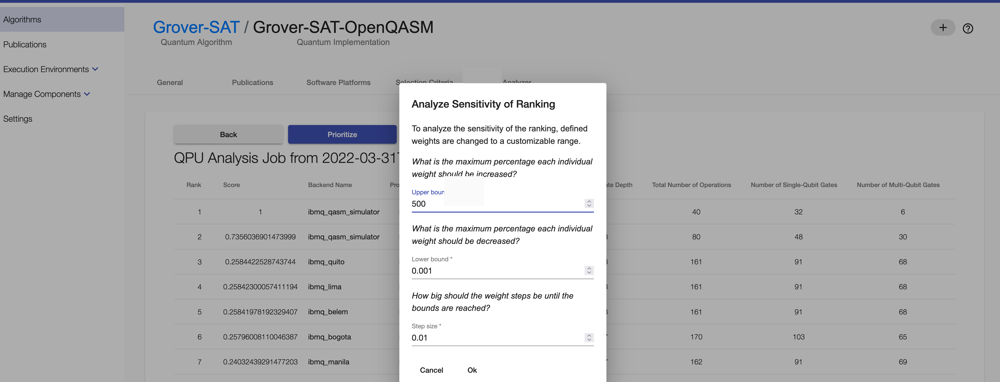

# Prioritization of Compiled Quantum Circuits based on Previous Execution Results

This guidance guides you through the process of compiling a quantum circuit on different quantum computers with several quantum compilers.  
  
All data of the case study are contained in [sample-data](./sample-data).

### Prerequisites
+ Docker Engine - [Install Guide](https://docs.docker.com/engine/install/)
+ Docker Compose - [Install Guide](https://docs.docker.com/compose/install/)
+ Clone this repository
+ Required ports are listed [here](./Docker/README.md)

### 1. Add Qiskit Credentials to docker-compose.override.yml
1. Copy the [_docker-compose.override.yml](./Docker/_docker-compose.override.yml) file in the Docker folder
to `docker-compose.override.yml`.
2. Insert your Qiskit token at `QPROV_IBMQ_TOKEN: 'your-qiskit-token-here'` in the `docker-compose.override.yml`.

**Note:** Currently only quantum computers of IBMQ are supported.

### 2. Run the UI and all required components
Open a console, navigate to the folder [Docker](./Docker), and run the following commands:

1. `docker-compose pull`
2. `docker-compose build db`
3. `docker-compose up`

After a few seconds, the ecosystem is up and running, and you can access it via the browser on <http://localhost:80>.
The UI is visible.

### 3. Application

1. In the UI, under "Execution Environments" > "Software Platforms", e.g., the SDK "Qiskit" is listed.
   
  
2. Go to "Algorithms" to see a list of algorithms. You can add a new algorithm (button under "Search") by inserting a name and choosing its computation model.
   
  
3. In context of an algorithm, go to the "Implementations" tab where implementations are listed. You can add a new implementation to the algorithm by choosing a name for the circuit you want to compile.
   
  
4. In context of the implementation, go to the "Selecion Criteria" tab > insert the URL of the raw circuit, specifiy its SDK and select its language > save your adaptions.  
   
  
5. Go to the "NISQ Analyzer" tab in context of the implementation > click "New Analysis", mark "Include Simulators", and insert you token of the Qiskit SDK.
The analysis is complete when the "Show analysis" button occurs.
   
   
  
6. Click on the "Show analysis" button to see suitable compiled circuits and their metric values for different quantum computers of several quantum compilers. 
To see all metric values scroll horizontally. It is automatically checked if the quantum computer metrics used for compilation are still up-to-date.
   
  
7. For executing a compiled circuit: click "Execute" > wait some time > click "Show result".
   
  
8. To prioritize the list of compiled circuits, click the "Prioritize" button, select predefined preferences or define own weights.  
     
When defining own weights, you can select the MCDA method to be applied and adapt, if needed, the importance points for the individual metrics, as described in the dialog, then, click "Ok".
   
When selecting predefined preferences you can choose the MCDA method, and in case of stable execution results, also the weighting method.
   

8.1 If a ranking based on stable execution results is desired, a "learning weights" processing dialog appears. When weights are learned by the selected weighting method, the list of weights appears, and they can be adjusted. By clicking "Ok" the prioritization with the weights is started.
   

9. When the prioritization process is finished, the rank and the score of each compiled circuit is presented.
   

10. The sensitivity of the ranking can be analyzed (in case TOPSIS or PROMETHEE II were previously selected to rank) by clicking the "Analyze Rank Sensitivity" button. The dialog enables to adjust the analysis parameters.
   

11. As soon as the analysis result is returned, a "Sensitivity Analysis Result" button appears.
    

12. By clicking on this button, a new window opens, showing a plot visualizing the analysis result.
    

### 4. Stop the environment

1. To stop the environment go to the console window with the docker-compose running, stop the process (e.g. control+shift+C for Mac).
2. To remove all volumes run `docker-compose down -v`.

## Haftungsausschluss

Dies ist ein Forschungsprototyp.
Die Haftung für entgangenen Gewinn, Produktionsausfall, Betriebsunterbrechung, entgangene Nutzungen, Verlust von Daten und Informationen, Finanzierungsaufwendungen sowie sonstige Vermögens- und Folgeschäden ist, außer in Fällen von grober Fahrlässigkeit, Vorsatz und Personenschäden, ausgeschlossen.

## Disclaimer of Warranty

Unless required by applicable law or agreed to in writing, Licensor provides the Work (and each Contributor provides its Contributions) on an "AS IS" BASIS, WITHOUT WARRANTIES OR CONDITIONS OF ANY KIND, either express or implied, including, without limitation, any warranties or conditions of TITLE, NON-INFRINGEMENT, MERCHANTABILITY, or FITNESS FOR A PARTICULAR PURPOSE.
You are solely responsible for determining the appropriateness of using or redistributing the Work and assume any risks associated with Your exercise of permissions under this License.

## License

SPDX-License-Identifier: Apache-2.0
